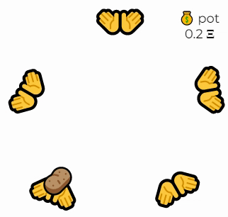
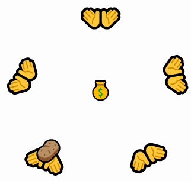
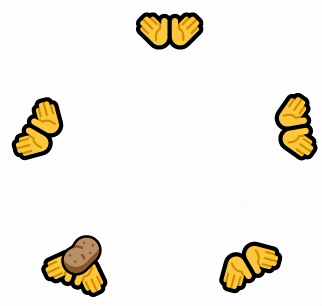

# Hot Potatoes

[Hot Potatoes](https://hot-potato-blush.vercel.app/) is an NFT collection that rewards users for actually doing stuff with them.

### Mechanics

Every time you pass your potato, a percentage of the selling fee gets put into a pot.

More transfers + floor raises = a juicy pot.

But this is hot potato. This collection goes through perpetual epochs between 1 and 4 days. When the epoch ends, current holders receive the pot! Afterwards, the clock resets and a new epoch begins.

